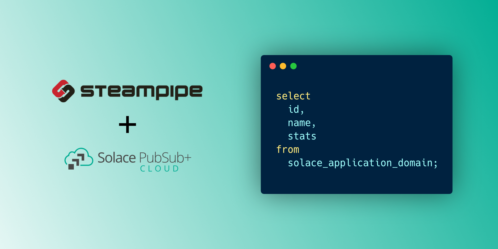

[](CODE_OF_CONDUCT.md)

# Solace PubSub+ Cloud plugin for Steampipe

Use SQL to query configurations, consumers, events and more from Solace.

- **[Get started →](https://hub.steampipe.io/plugins/solacelabs/solace)**
- Documentation: [Table definitions & examples](https://hub.steampipe.io/plugins/solacelabs/solace/tables)
- Community: [Slack Channel](https://steampipe.io/community/join)
- Get involved: [Issues](https://github.com/solacelabs/steampipe-plugin-solace/issues)

## Overview

The goal is to retrieve information on [Solace PubSub+ Cloud](https://solace.com/products/platform/cloud/) resources via SQL queries using Solace plugin for Steampipe.

[Steampipe](https://steampipe.io) is an open-source framework for querying, analyzing, and working with data from various sources. It provides a unified and declarative way to interact with disparate data sources, such as databases, cloud providers, and APIs, using SQL syntax.

Plugins are what Steampipe uses to define the schema for remote resources. The Solace plugin for Steampipe defines which tables are available and performs API calls to query those resources.

## Quick start

### Install

Download and install the latest Solace plugin:

```bash
steampipe plugin install SolaceLabs/solace
```

Configure your [credentials](https://hub.steampipe.io/plugins/solacelabs/solace#credentials) and [config file](https://hub.steampipe.io/plugins/solacelabs/solace#configuration).

Configure your account details in `~/.steampipe/config/solace.spc`:

```hcl
connection "solace" {
  plugin = "SolaceLabs/solace"

  # Autentication information
  api_token = "XXXXXXXXX"

  api_url = "https://api.solace.cloud/"
}
```

Or through environment variables:

```sh
export SOLACE_API_TOKEN=XXXXXXXXX
export SOLACE_API_URL=https://api.solace.cloud/
```

Run steampipe:

```shell
steampipe query
```

List application domains:

```sql
select
  id,
  name,
  stats
from
  solace_application_domain;
```

```
+-------------+-------------------------------------+-------------------------------------------------------------------------------------------------------------------+
| id          | name                                | stats                                                                                                             |
+-------------+-------------------------------------+-------------------------------------------------------------------------------------------------------------------+
| n8xj0k6rx5i | AcmeRetail - Enterprise Governance  | {"applicationCount":0,"enumCount":3,"eventApiCount":1,"eventApiProductCount":0,"eventCount":2,"schemaCount":2}    |
| sfxq3pd8xcw | AcmeRetail - SAP S/4                | {"applicationCount":1,"enumCount":2,"eventApiCount":1,"eventApiProductCount":1,"eventCount":8,"schemaCount":26}   |
| dux1k1p9xsg | AcmeRetail - CRM                    | {"applicationCount":1,"enumCount":0,"eventApiCount":0,"eventApiProductCount":0,"eventCount":3,"schemaCount":1}    |
| u2x73phaxbj | AcmeRetail - Human Relationships    | {"applicationCount":2,"enumCount":2,"eventApiCount":0,"eventApiProductCount":0,"eventCount":3,"schemaCount":5}    |
| 9nxoj6yfxm3 | AcmeRetail - Store Operations       | {"applicationCount":6,"enumCount":3,"eventApiCount":1,"eventApiProductCount":0,"eventCount":2,"schemaCount":2}    |
| 4tx0jilaxt2 | AcmeRetail - Supply Chain           | {"applicationCount":2,"enumCount":3,"eventApiCount":1,"eventApiProductCount":0,"eventCount":2,"schemaCount":2}    |
| 72x10oegx7u | AcmeRetail - Facilities             | {"applicationCount":1,"enumCount":4,"eventApiCount":1,"eventApiProductCount":1,"eventCount":2,"schemaCount":2}    |
+-------------+-------------------------------------+-------------------------------------------------------------------------------------------------------------------+
```

## Developing

Prerequisites:

- [Steampipe](https://steampipe.io/downloads)
- [Golang](https://golang.org/doc/install)

Clone:

```sh
git clone https://github.com/SolaceLabs/steampipe-plugin-solace.git
cd steampipe-plugin-solace
```

Build, which automatically installs the new version to your `~/.steampipe/plugins` directory:

```
make
```

Configure the plugin:

```
mkdir -p ~/.steampipe/config
cp config/* ~/.steampipe/config
vi ~/.steampipe/config/solace.spc
```

Check the status of pluging
```
steampipe plugin list
```
This should give you information on the installed plugins
```
+---------------------------------------------------+---------+-------------+
| Installed Plugin                                  | Version | Connections |
+---------------------------------------------------+---------+-------------+
| hub.steampipe.io/plugins/SolaceLabs/solace@latest | local   | solace      |
+---------------------------------------------------+---------+-------------+
```

Try it!

```
steampipe query
> .inspect solace
```

Further reading:

- [Writing plugins](https://steampipe.io/docs/develop/writing-plugins)
- [Writing your first table](https://steampipe.io/docs/develop/writing-your-first-table)

## Resources

This is not an officially supported Solace product.

For more information try these resources:
- Ask the [Solace Community](https://solace.community)
- The Solace Developer Portal website at: https://solace.dev

## Contributing

Please see the [contribution guidelines](https://github.com/turbot/steampipe/blob/main/CONTRIBUTING.md) and our [code of conduct](https://github.com/turbot/steampipe/blob/main/CODE_OF_CONDUCT.md). All contributions are subject to the [Apache 2.0 open source license](https://github.com/SolaceLabs/steampipe-plugin-solace/blob/main/LICENSE).

`help wanted` issues:

- [Steampipe](https://github.com/turbot/steampipe/labels/help%20wanted)
- [Solace Plugin](https://github.com/SolaceLabs/steampipe-plugin-solace/labels/help%20wanted)

## Authors
See the list of [contributors](https://github.com/solacecommunity/<github-repo>/graphs/contributors) who participated in this project.

## License
See the [LICENSE](LICENSE) file for details.
